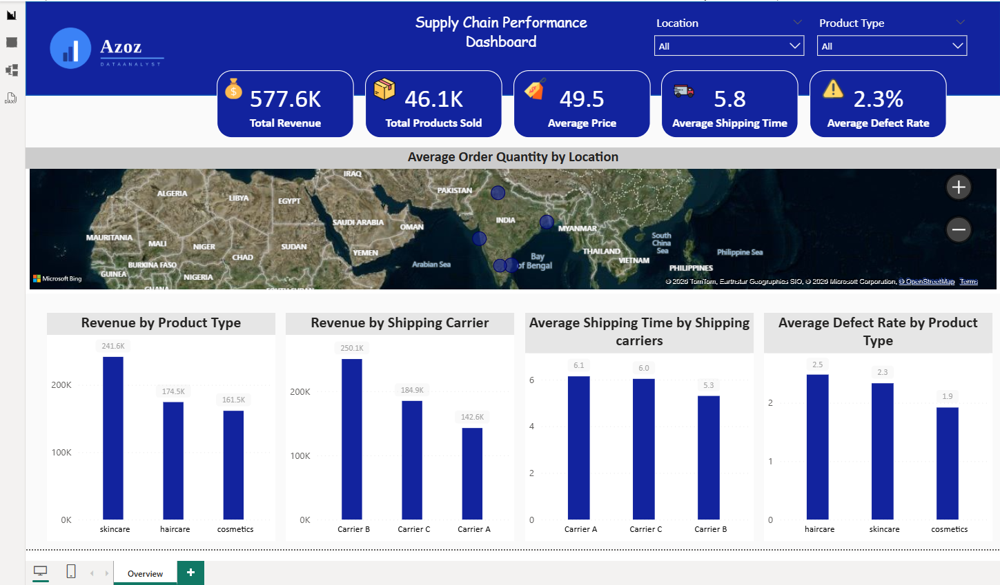

# 📊 Supply Chain Performance Dashboard

Interactive Supply Chain Analytics Dashboard built using **SQL Server** and **Power BI**.

---

## 📷 Dashboard Preview



---

## 📌 Project Overview

This dashboard analyzes supply chain performance and provides interactive insights into:

- Revenue Performance
- Product Sales
- Shipping Performance
- Product Quality
- Geographic Order Distribution

---

## 📈 Key KPIs

- 💰 Total Revenue
- 📦 Total Products Sold
- 🏷️ Average Price
- 🚚 Average Shipping Time
- ⚠️ Average Defect Rate

---

## 📊 Dashboard Features

- Revenue by Product Type
- Revenue by Shipping Carrier
- Average Shipping Time Analysis
- Product Defect Rate Analysis
- Geographic Order Distribution
- Interactive Filters (Location & Product Type)

---

## 🛠️ Tools Used

- SQL Server
- Power BI
- DAX
- Power Query

---

## 📂 Repository Structure

```
Dashboard/
    SupplyChainDashboard.pbix

Images/
    dashboard.png
```

---

## 🚀 How to Use

1. Download the `.pbix` file.
2. Open it using Power BI Desktop.
3. Explore the interactive dashboard.

---

## 👤 Author

**Abdulaziz Alsabaan**

- GitHub: https://github.com/abdulazizalsabaan
- LinkedIn: https://www.linkedin.com/in/abdulaziz-alsabaan-7483a3205

---

## 📄 License

This project is licensed under the MIT License.
